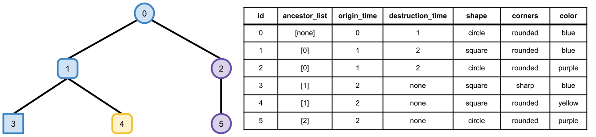

# Phylogeny Standard

A phylogeny depicts parent-child relationships of taxa over the course of evolution.
Phylogenies can be constructed for any taxonomic unit of organization (_e.g._,
individuals, genotypes, phenotypes, etc.).
We use the term taxa to refer generally to entities in a phylogeny.

**Navigation:**

<!-- TOC -->

- [Properties](#properties)
  - [Required Properties](#required-properties)
  - [Conventional Properties](#conventional-properties)
  - [Extra Properties](#extra-properties)
- [Example](#example)
- [Suggestions/Issues/Contributions](#suggestionsissuescontributions)

<!-- /TOC -->

## Properties

### Required Properties

These are the minimum set of properties (i.e., fields) required to specify a phylogeny.
You must have this information to conform to the standard.

- **id**: A unique identifier. Must be a non-negative integer.
  - There is a proposal to change this property name: [https://github.com/alife-data-standards/alife-data-standards/issues/16](https://github.com/alife-data-standards/alife-data-standards/issues/16)
- **ancestor_list**: A list of ids. These must correspond to other entities (entries) in the current file.
  They are assumed to refer to the most direct ancestor(s) of this entity that exist with in a file.
  In many cases, these will be the direct parent(s) of this entity, but this will not always be the case.

### **id** Specification & Representation Details

Identifier values should be less than or equal to 2,147,483,647 (`2^{31} - 1`).
This limit corresponds to the maximum representable value for the signed 32 bit integer datatype.
(If more than `2^{31} - 1` rows are required, larger identifier values may be used but full tooling support is not guaranteed.)

Identifier values are not required to be allocated sequentially.
Row order is not required to be sorted by identifier values.

If using a serialization format that supports first-class integer representations within row columns (e.g., JSON), that representation should be used to serialize **id** entries.

If using a serialization format without direct support for integer representation within row columns, **id** entries should be serialized as strings.
Such string representations must be base 10, must not include leading zeroes, and may only contain the characters `0`, `1`, `2`, `3`, `4`, `5`, `6`, `7`, `8`, and `9` (i.e., no whitespace, thousands separators, or decimal separator).

| Example **id** | Valid?                 |
|----------------|------------------------|
| `1322`         | :white_check_mark: yes |
| `1322.`        | :x: no                 |
| `52a`          | :x: no                 |
| `01322`        | :x: no                 |
| `1,322`        | :x: no                 |
| `1 322`        | :x: no                 |

### Conventional Properties

These are common, but not required properties, for describing phylogenies.
If you have any of this information in your data, you should format it conventionally.

- **origin_time:** Time that this entity first came into existence (in whatever time units the system that generated this data uses).
- **destruction_time:** Time that this entry went out of existence (in whatever time units the system that generates this data uses).

### Extra Properties

Additional properties can always be added (as long as their names do not conflict with the names of existing properties).
Some tools may require specific additional properties to be present.
If it becomes apparent at any point that one of these properties is of use to a sizable portion of the community,
a discussion should be opened about adding it to the official list of conventional properties.

## Example

Below is a toy phylogenetic tree and a standard-compliant data table that specifies
the phylogeny, including required, conventional, and extra properties.

## Suggestions/Issues/Contributions

The phylogeny standard is still under active discussion. Join in [here](https://github.com/alife-data-standards/alife-data-standards/issues?q=is%3Aissue+is%3Aopen+label%3Aphylogeny)!
